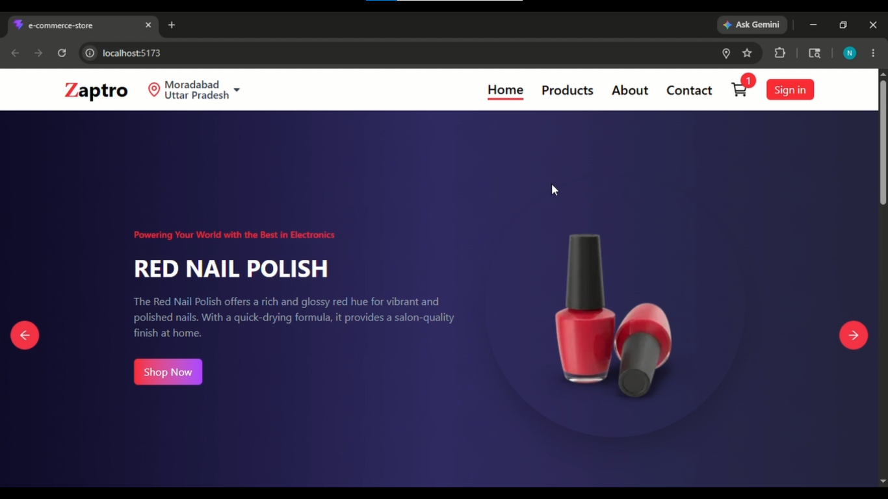

# 🛒 Modern E-Commerce Frontend

A fully responsive and modern E-Commerce Frontend application built using React and Tailwind CSS. This project integrates FakeStore API for dynamic product data and focuses on delivering a clean UI, smooth user experience, and scalable frontend architecture.

---

## 🚀 Features

- 🔐 Authentication with Clerk
- 🛍️ Dynamic Product Listing
- 📄 Product Detail Pages
- 🛒 Add to Cart UI
- ⚡ Fast API Integration using Axios
- 🎠 Product Sliders & Carousels
- 🔔 Toast Notifications
- 📱 Fully Responsive Design
- ⬆️ Scroll to Top Functionality
- ✨ Smooth Animations with Lottie
- 🎨 Modern Icons & UI Components

---

## 🛠️ Tech Stack

### Frontend
- React
- React Router DOM

### Styling
- Tailwind CSS v4
- Tailwind CSS Vite Plugin

### API & Utilities
- Axios
- FakeStore API

### Authentication
- Clerk Authentication

### UI & Animations
- Swiper.js
- React Slick
- Slick Carousel
- Lottie React
- Lucide React
- React Icons
- React Toastify

---

## ⚡ Getting Started

### Clone the repository:

- STEP 1: git clone <your-repository-url>

- STEP 2: npm install

- STEP 3: npm run dev

### 📸 Screenshots

### 👨‍💻 Author

Nabeel

⭐ Support

If you like this project, consider giving it a ⭐ on GitHub.